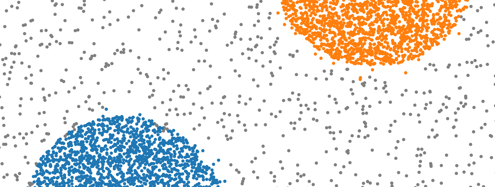

# High-Speed DBSCAN

This repository implements an approximate [DBSCAN](resources/dbscan.pdf) algorithm, with focus on execution speed for smaller datasets (~100-10k points).

## Rasterization

The approximate nature of the algorithm comes from a quantization/binning/rasterization step before the clustering, where each input point is assigned to a rectangular bin of size `raster_res`. The clustering then runs on the centroids of the bins, which potentially drastically reduces the effective number of input points. To retain the density-oriented nature of DBSCAN, the centroids are weighted by the number of datapoints they represent, and the modified DBSCAN algorithm respects these weights when estimating density.

The raster interacts with the DBSCAN algorithm's `eps` parameter and the chosen norm. My recommendation is that `raster_res` should be set to:
- `L1` norm: `raster_res < eps/n_dims`
- `L2` or `L2Squared` norm: `raster_res < eps/sqrt(n_dims)`
- `Linf` norm: `raster_res < eps`

The larger the `raster_res` is, the more likely a bin will group more points, thereby speeding up the algorithm.

The curse of dimensionality can cause `eps` and `raster_res` to behave unintuitively on higher-dimensional datasets. To counteract this, I recommend the `Linf` (default is `L2Squared`) norm to be used. This norm works well with the rectangular bins even in higher dimensions, and as a nice side-effect, it is also a little faster to compute than the ususal `L2` norm.

## Low-bit primitives

The implementation uses low-bit signed integers to index the raster bins (default is `RasterType = i16`). This means the algorithm can only correctly handle values smaller than `RasterType::MAX * raster_res` in absolute value. Please make sure you center and scale the input data so it fits into this range.

The input indexes/weights/cluster IDs also use low-bit unsigned integers (default is `IndexType = u16`). This means the number of input points needs to be lower than `IndexType::MAX`.

The float precision is also lowered (default is `FloatType = f32`), but this should not cause any significant inprecision compared to the far more likely inprecision stemming from the rasterization.

All types can be changed in `src/types.rs`.

## Usage

The example application can be run with:
```bash
cargo run --release
```
This takes the configuration values from `config.json`, and produces a scatter plot of a clustering into `plots/`.

As the main emphasis of this implementation is speed, the repo also contains extensive benchmarks, which can be invoked with:
```bash
cargo bench
```
Limiting the benchmarks to a subcategory is possible with:
```bash
cargo bench [category]
```
where the available categories are:
- rast
- prox
- dbscan
- e2e